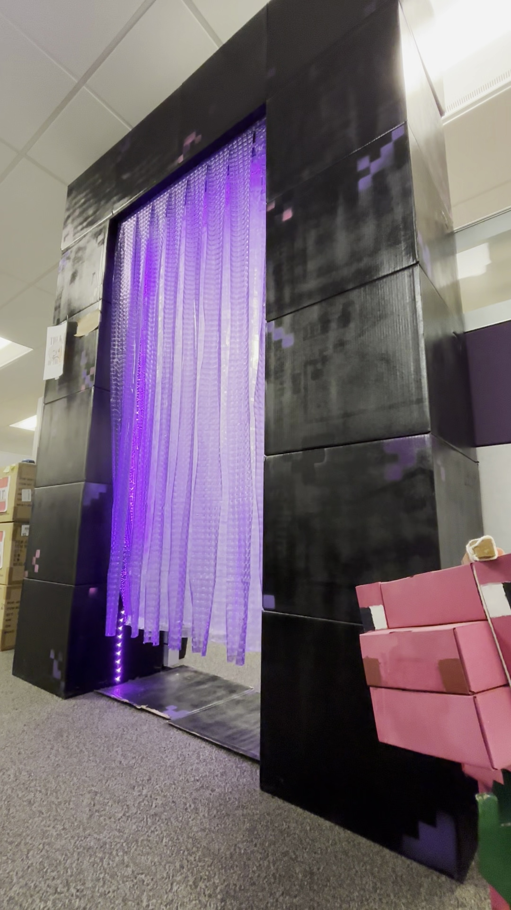

# Minecraft Nether Portal with Addressable LEDs

I made a nether portal you can walk through in 2024.  I blame a coworker: we joked about it in the morning, then he returned from lunch with a hardware store bag full of spray paint.  My kids helped, but the project size and time crept up and there was some predictable loss of attention.

Some features:
- Animated lighting using WS2812B addressable LEDs.
- Door-sized opening.
- 99" x 72" x 18" (8ft3 tall, 6ft wide, 1ft6 deep) (2.51m tall, 1.83m wide, 0.46m deep)
- It came apart to 4 pieces for transport.
- A Raspberry Pi Zero W ran the addressable LEDs.

I'm including some of the Python code here.

I believe I left it running `pulse.py` on reboot.

I had some more clever lighting animation idea: I was going to see how much of the game 2D texture animation could be evoked with clever use of the edge lighting.  I didn't follow through once the rotating lights and the size of the "art installation" made enough impact.

We had fun at the office with it.  I've handed the portal over now.  I hope it makes some others smile for another few years.
